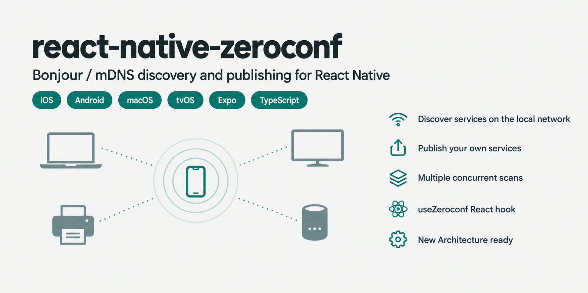

<p align="center">
  
</p>

Find the services other devices advertise on the local network (printers, speakers, cameras, your own servers) and advertise your own, on iOS, Android, macOS and tvOS.

**[Read the documentation](https://github.com/balthazar/react-native-zeroconf/wiki)**

## Installation

```bash
yarn add react-native-zeroconf
cd ios && pod install
```

On iOS, declare the service types you use in `NSBonjourServices`, see [Permissions and Setup](https://github.com/balthazar/react-native-zeroconf/wiki/Permissions-and-Setup). Expo works with development builds, see [Installation](https://github.com/balthazar/react-native-zeroconf/wiki/Installation).

## Usage

```javascript
import { useZeroconf } from 'react-native-zeroconf'

function Printers() {
  const { services } = useZeroconf({ type: 'ipp' })

  return services.map(service => (
    <Text key={service.name}>
      {service.name} {service.ipv4[0]}:{service.port}
    </Text>
  ))
}
```

Without React:

```javascript
import Zeroconf from 'react-native-zeroconf'

const zeroconf = new Zeroconf()
zeroconf.on('resolved', service => console.log(service.name, service.host, service.port))
zeroconf.scan({ type: 'http' })
```

## Documentation

- **Getting started**: [Installation](https://github.com/balthazar/react-native-zeroconf/wiki/Installation), [Permissions and Setup](https://github.com/balthazar/react-native-zeroconf/wiki/Permissions-and-Setup)
- **Guides**: [Scanning](https://github.com/balthazar/react-native-zeroconf/wiki/Scanning), [Publishing](https://github.com/balthazar/react-native-zeroconf/wiki/Publishing), [React Integration](https://github.com/balthazar/react-native-zeroconf/wiki/React-Integration), [Error Handling](https://github.com/balthazar/react-native-zeroconf/wiki/Error-Handling)
- **Reference**: [API Reference](https://github.com/balthazar/react-native-zeroconf/wiki/API-Reference), [Platform Support](https://github.com/balthazar/react-native-zeroconf/wiki/Platform-Support)
- **Android**: [Android Implementations](https://github.com/balthazar/react-native-zeroconf/wiki/Android-Implementations), [Android Emulator](https://github.com/balthazar/react-native-zeroconf/wiki/Android-Emulator)
- **Help**: [Troubleshooting and FAQ](https://github.com/balthazar/react-native-zeroconf/wiki/Troubleshooting-and-FAQ), [Migration Guide](https://github.com/balthazar/react-native-zeroconf/wiki/Migration-Guide)
- **Project**: [Contributing](https://github.com/balthazar/react-native-zeroconf/wiki/Contributing), [example app](./example)

## License

MIT, see [LICENSE](LICENSE). Includes [RxDNSSD](https://github.com/discord/RxDNSSD) (Apache 2.0, see [NOTICE](NOTICE)) and Apple's mDNSResponder (mostly Apache 2.0, see its [LICENSE](android/src/main/jni/mdnsresponder/LICENSE)).
